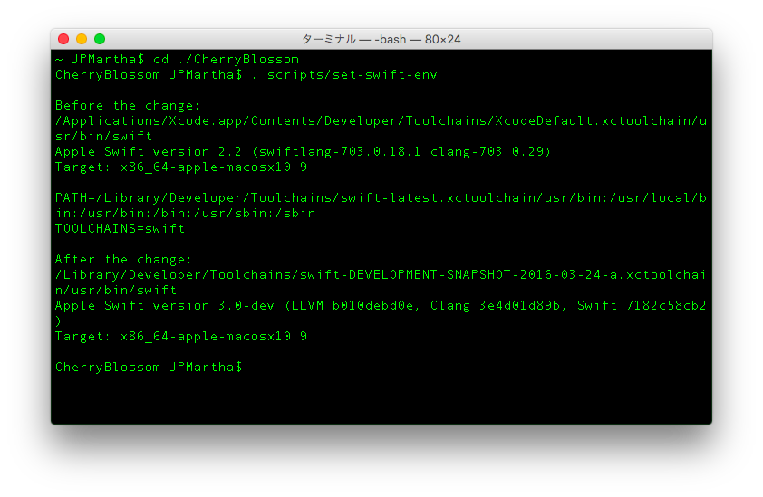

# CherryBlossom [](https://travis-ci.org/JPMartha/CherryBlossom)

**CherryBlossom** is _**UNOFFICIAL**_ development utilities for Swift.

### For Swift 3.0

- Installing Development Snapshot
- Managing Swift Environments

### For the Swift Package Manager

- Rebuilding The Swift Package Manager
- Testing The Swift Package Manager

<br />

> _**⚠️ PLEASE NOTE!**_
>
> _**NOT official.**_
>
> _**IN NO EVENT SHALL THE AUTHORS OR COPYRIGHT HOLDERS BE LIABLE FOR ANY CLAIM, DAMAGES OR OTHER LIABILITY, WHETHER IN AN ACTION OF CONTRACT, TORT OR OTHERWISE, ARISING FROM, OUT OF OR IN CONNECTION WITH THE SOFTWARE OR THE USE OR OTHER DEALINGS IN THE SOFTWARE.**_




<br />

## Getting Started

The first step to use **CherryBlossom** is to set the `TOOLCHAIN_VERSION` in the `Makefile`.

- e.g. `2016-03-24-a`
  
If you try to develop the Swift Package Manager, set the `SWIFTPM_DEVELOPMENT_DIRECTORY` in the `Makefile`.

- e.g. `$(HOME)/swift-package-manager`

<br />

## For Swift 3.0

### Installing Development Snapshot

Download and install Swift from [Swift.org](https://swift.org).

```bash
$ make swift-install
```

For more information, see the [Download Swift](https://swift.org/download/#snapshots).

<br />

### Managing Swift Environments

Set your `PATH` and `TOOLCHAINS` environment variables.

```bash
$ cd <your-cherryblossom-directory>
$ . scripts/set-swift-env
```

For more information, see [https://github.com/apple/swift-package-manager/](https://github.com/apple/swift-package-manager/tree/swift-DEVELOPMENT-SNAPSHOT-2016-03-24-a#managing-swift-environments).

<br />

## For the Swift Package Manager

### Rebuilding The Swift Package Manager

Rebuild the Swift Package Manager itself with the bootstrap script.

```bash
$ make swiftpm-rebuild
```

<br />

> _**⚠️ PLEASE NOTE!**_
>
> _**OVERRIDE your `swift-build` and your `swift-test` in the `SWIFTPM_EXECUTIVE_DIRECTORY` which you set in the `Makefile`.**_

If you want to revert, run `$ make swift-install` again. 💁

<br />

For more information, see [https://github.com/apple/swift-package-manager/](https://github.com/apple/swift-package-manager/tree/swift-DEVELOPMENT-SNAPSHOT-2016-03-24-a#development).

<br />

### Testing The Swift Package Manager

Test the Swift Package Manager itself with the bootstrap script after rebuilding.

```bash
$ make swiftpm-test
```

An error has occured without building.

```bash
error: unable to find 'swift-build-tool' tool for bootstrap build
```

For more information, see [https://github.com/apple/swift-package-manager/](https://github.com/apple/swift-package-manager/tree/swift-DEVELOPMENT-SNAPSHOT-2016-03-24-a#contributing).

<br />

## Options

If your current directory is not the CherryBlossom directory, set it with `-C` option.

Change to the directory before doing anything.

```bash
$ make swiftpm-rebuild -C <your-cherryblossom-directory>
```

<br />

## License

Licensed under [MIT License](LICENSE).
